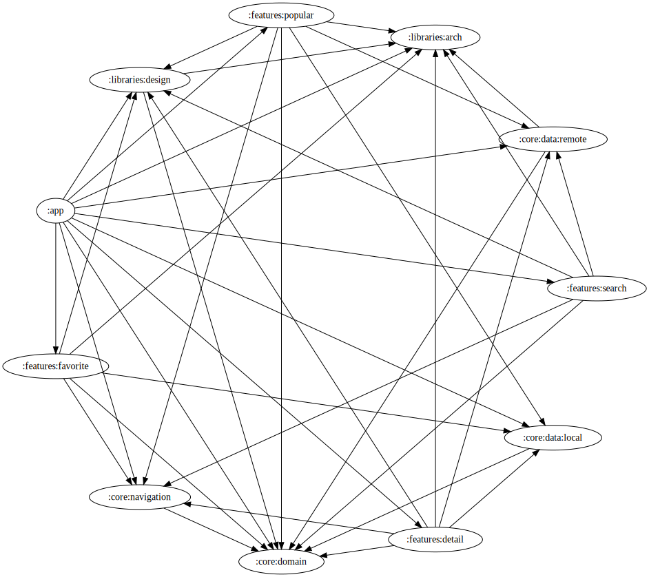
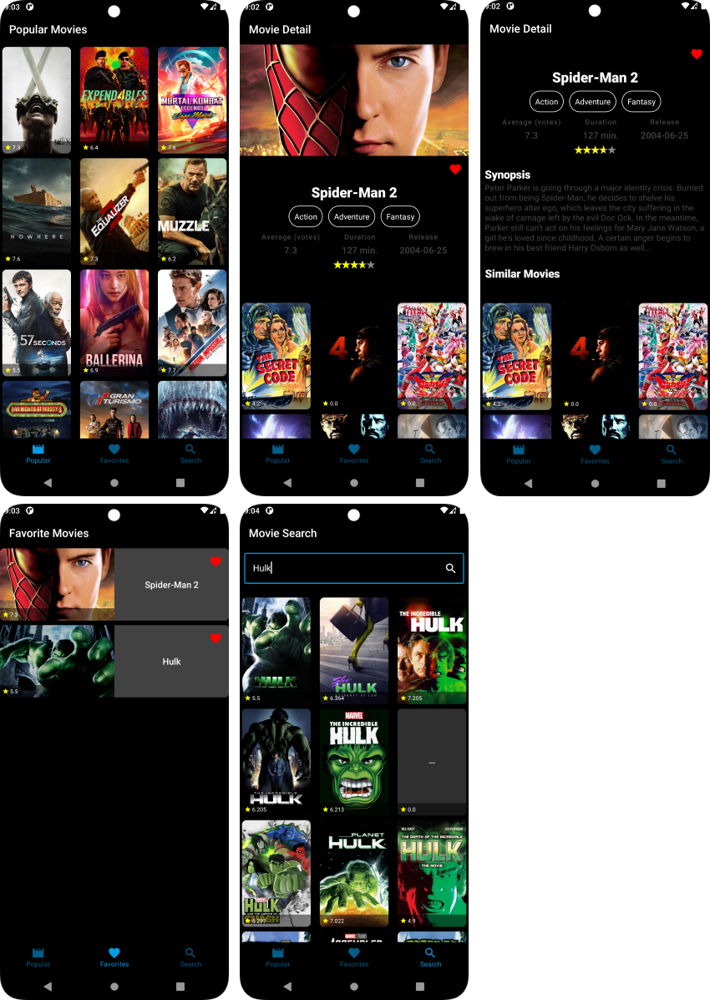

# TMDBCompose

This POC/(proof of concept) project focuses on Android `Instrumentation Tests`, with `Robot Pattern` for test structure. The code is characterized by:

- **Feature Modularization**: The code is organized into modules based on specific features.
- **Clean Architecture**: Application of Clean Architecture principles for separation of concerns and decoupling.
- **MVVM Pattern (Model-View-ViewModel)**: Use of the MVVM UI pattern for separating business logic and user interface.
- **Dependency Injection with Hilt**: Dependency management using Hilt for dependency injection.
- **Kotlin Coroutines**: For asynchronous tasks.
- **Flow, StateFlow, and SharedFlow**: Use of these components for managing states and asynchronous interactions.
- **Jetpack Compose**: Implementation of the UI with Jetpack Compose, Android's modern UI toolkit.

The project also integrates other technologies and libraries, such as `Retrofit` for network calls, Paging3 for `pagination`, among others.

---

This project has been developed in Android Studio version:
-  `Giraffe | 2022.3.1 Patch 2`
-  `Build #AI-223.8836.35.2231.10811636`
-  `Java JDK 17`

To get started with this project, you'll need an API key from The Movie Database (TMDB). Find more details and instructions on how to obtain the key [here](https://developer.themoviedb.org/docs).

Once you've obtained your API key, run the project. Gradle will generate a file named `apiKey.properties` at the project root where you can insert your API key as follows:

`apiKey.properties`
```plaintext
  #Sat Oct 21 16:54:38 BRT 2023
  API_KEY=".....e5fc1.....f78fe.....1144a"
```

## Module Dependencies

- [Modularization](https://developer.android.com/topic/modularization)



## Unit tests, integration tests and instrumentation tests

- [Espresso](https://developer.android.com/training/testing/espresso)

- [Mockk](https://mockk.io/ANDROID.html)

- [Robot Pattern](https://jakewharton.com/testing-robots/)

## Screens

